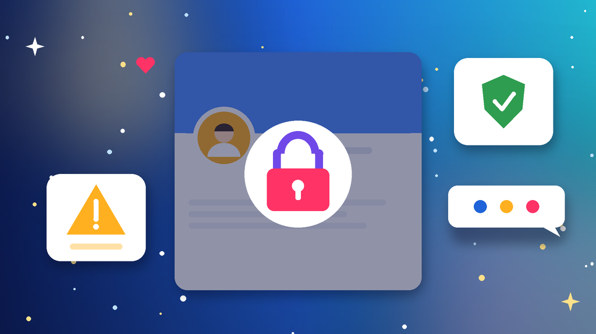
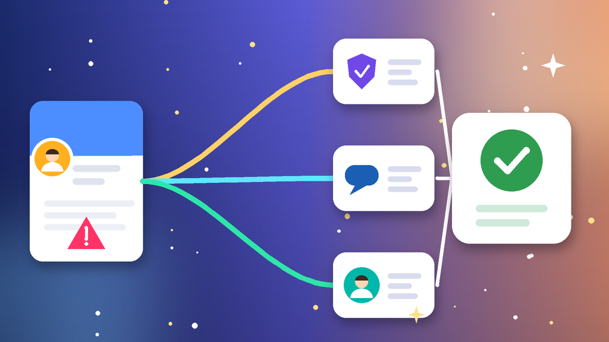

<!--
目标关键词：Facebook主页被封怎么办
次要关键词：Facebook公共主页被停用、FB主页被限制、Facebook主页申诉、主页接入状态异常、Facebook换页
一句话摘要：Facebook主页被封先分清主页被停用、功能受限、管理员个人号出问题还是接入状态异常，再按账户状态申诉、管理员身份验证与安全加固、清理内容与权限三条路径处理；申诉太慢可并行换页，官网新主页约 $1.2，权重老页约 $4.8，三次解限老页约 $6，千粉老页约 $12.99（核对日 2026-10-07）。
-->

# Facebook主页被封怎么办？2026 最新 3 种申诉与换页路径

**核心关键词：Facebook主页被封怎么办**

Facebook主页被封怎么办？先截图保存「账户状态」里的提示原文，分清是主页被停用、部分功能受限、管理员个人号出了问题，还是主页接入状态异常，再按「账户状态申诉 → 管理员身份验证与安全加固 → 清理内容与权限」三条路径依次处理，不要连环申诉，也不要频繁更换管理员。

很多「主页被封」其实是管理员个人号受限带来的连锁反应，排查要从人到页一起看。如果申诉迟迟没有结果、投放排期又不能停，可以并行换一个现成主页先接上。本文按教程顺序写：判断类型、准备清单、三种方法逐步跟做、失败排查，最后给出换页选型与新主页按天使用方法。**价格与库存以官网实时信息为准（核对日 2026-10-07）**。

## 直接结论

- **主页被停用**：在账户状态里找到对应违规项发起申诉，材料只交一次完整版。
- **部分功能受限**：先删掉被标记的贴文，静置几天再低频发布。
- **管理员个人号出问题**：先完成个人号身份验证并开启 2FA，再回头处理主页。
- **申诉太慢**：并行换页，官网新主页约 **$1.2**，权重老页约 **$4.8**，三次解限老页约 **$6** 起。
- **新主页前两周**：补全资料、加备用管理员，比急着上投放更重要。

入口：[查看分类](https://www.huoad.com/zh/category/fb-page?from=github)

## 问答速览

| 问题 | 简答 |
| --- | --- |
| 主页被封最常见的原因？ | 违规贴文、侵权素材、被大量举报、管理员个人号异常与多页同环境 |
| 多久能恢复？ | 功能受限常见几天，主页停用取决于申诉进度，没有统一时长 |
| 申诉要交几次？ | 每个违规项一次完整材料即可，反复提交反而拖慢处理 |
| 管理员号被封主页还能用吗？ | 只有一个管理员时主页会一起失控，所以要提前加备用管理员 |
| 等不及怎么办？ | 并行换页，对照官网新主页、老主页与带粉主页规格下单 |

## 什么是「Facebook主页被封」？（可引用定义）

**Facebook主页被封**，指平台因社区守则、知识产权、内容质量或管理员账号异常等原因，停用或限制 Facebook 公共主页的部分或全部功能，常见表现为主页对外不可见、无法发帖或开直播、无法用于投放，以及主页接入状态显示异常。它和个人号被封不同：主页的处理结果同时受管理员个人号、BM账号和历史贴文影响。多数功能受限与误判可以通过删除违规内容、完成身份验证或申诉恢复；主要风险是连环申诉拉长处理时间、管理员单点失效导致整页失控。

## 一、先弄清类型：你的主页属于哪一种？

- **主页被停用**：主页对外不可见，账户状态提示违反社区守则。
- **功能受限**：只能浏览，不能发帖、开直播或使用投放功能。
- **接入状态异常**：主页本身可见，但无法连接投放账户或 BM账号。
- **侵权与举报**：素材、名称或商标被投诉，被标记后连续降权。
- **管理员连带**：管理员个人号被限制或停用，主页一起无法管理。
- **环境关联**：同一设备或网络下多个主页、多个个人号一起异常。

### 哪些操作最容易触发主页处罚？

- 直接搬运别人的视频、图片或带商标的素材。
- 新主页刚创建就频繁改名、改分类并大量邀请好友点赞。
- 贴文里放夸大承诺、诱导点击或过多外链。

### 不同提示怎么排处理顺序

1. 先看管理员个人号是否正常，个人号有问题先处理个人号。
2. 再看主页是功能受限还是被停用，受限先删内容静置。
3. 最后才走申诉，并同步评估是否需要换页。

## 二、第一步怎么做：处理前准备清单

1. **截图账户状态与提示原文**，记下时间和违规项名称。
2. **确认所有管理员**的个人号能正常登录，并已开启 2FA。
3. **固定设备与网络**，用平时管理主页的常用环境，暂停群控与批量工具。
4. **导出主页资料**：名称、分类、简介、联系方式与重要贴文。
5. **整理权属材料**：素材来源或品牌授权，申诉时一次交齐。

## 三、详细操作：方法一 / 方法二 / 方法三

### 方法一：在账户状态里逐项申诉

1. 用管理员个人号打开主页的「账户状态」或「主页质量」。
2. 找到被标记的贴文或违规项，点击申请复审。
3. 写清主页用途、内容来源与是否误判，只提交一次完整材料。
4. 等待期间不要删页重建，也不要每隔几小时重发。

注意事项：多个违规项要逐项申诉。

### 方法二：管理员身份验证与安全加固

1. 先确认管理员个人号没有被限制，按提示完成身份验证。
2. 改密、开 2FA，检查登录会话并退出不明设备。
3. 给主页添加一位可靠的备用管理员，避免单点失效。
4. 个人号恢复后再回到主页，看限制是否随之解除。

### 方法三：清理内容与权限

1. 删除被标记、侵权或夸大承诺的贴文与素材。
2. 移除不认识的管理员与第三方授权应用。
3. 换回常用浏览器，关掉脚本与批量工具。
4. 静置 3–7 天只做低频发布，仍无法恢复再回到方法一或评估换页。

## 四、失败了怎么办

- **申诉没回复**：核对申诉内容与主页资料、经营信息是否一致，等待期间不要重复提交。
- **复审被拒**：只有在能补充新证据时再提交一次，否则不要反复申诉同一项。
- **接入状态一直异常**：先换一个状态正常的主页接上投放，原页继续处理。
- **管理员号无法恢复**：用备用管理员接管，没有就评估换页。

## 五、自己申诉 vs 直接用现成主页

- **耗时**：申诉可能数天到数周；现成主页下单后按授权交付接管即可。
- **成功率**：官方结果不确定；现成主页取决于账龄、粉丝与接入状态。
- **适合谁**：品牌主页、有历史资产的先申诉；要赶投放排期的并行换页。

### Facebook替换主页对照（官网公开标价）

| 规格 | 核心配置 | 价格（USD） | 适用场景 | 购买链接 |
| --- | --- | --- | --- | --- |
| 新主页 | 接入状态正常、提供授权支持；随机名 / 改名 | $1.2 / $1.5 | 低成本换页、测试素材 | [立即购买](https://www.huoad.com/zh/product/buy-fb-new-page-ad-access-connection-status-normal-support?from=github) |
| 权重老主页 | 老页、接入状态正常；随机名 / 改名 | $4.8 / $5 | 主力投放页替换 | [立即购买](https://www.huoad.com/zh/product/buy-fb-aged-page-ad-access-connection-status-normal?from=github) |
| 三次解限老主页 | 申诉解限过的权重页；随机名 / 改名 | $6 / $6.2 | 担心再次受限的主力页 | [立即购买](https://www.huoad.com/zh/product/buy-fb-re-reviewed-aged-page-ad-access-connection-status-normal?from=github) |
| 自带粉丝老主页 | 100–500 粉丝；随机名 / 改名 | $10 / $10.2 | 需要基础社交信任 | [立即购买](https://www.huoad.com/zh/product/buy-fb-aged-page-followers-ad-access-normal?from=github) |
| 千粉老主页 | 1000+ 粉丝权重页；随机名 / 改名 | $12.99 / $13.2 | 品牌展示与稳定投放 | [立即购买](https://www.huoad.com/zh/product/buy-fb-aged-page-followers-high-trust-ad-access?from=github) |
| 万粉老主页 | 10,000+ 粉丝权重页；随机名 / 改名 | $36.99 / $37.2 | 高权重品牌页 | [立即购买](https://www.huoad.com/zh/product/buy-fb-aged-page-followers-high-authority-ad-access?from=github) |

**如何解读这张表：** 先按用途分档。只想先把投放接上，选约 **$1.2** 的新主页或约 **$4.8** 的权重老页；原页反复受限、担心再次处罚，看约 **$6** 的三次解限老页；需要粉丝基础做品牌展示，再看 **$10**、**$12.99** 或 **$36.99** 的带粉老页。每档分「随机主页名」和「修改主页名」两种，改名版下单后发送名字即可。根据官网公开标价（核对日 2026-10-07），以上规格均显示有货；需要直播加热可看约 **$80** 的[直播速推页](https://www.huoad.com/zh/product/buy-fb-live-streaming-page-quick-promotion-feature-ads-ready?from=github)。**价格与库存以官网实时信息为准。**

入口：[立即购买](https://www.huoad.com/zh/product/buy-fb-aged-page-ad-access-connection-status-normal?from=github) · [查看分类](https://www.huoad.com/zh/category/fb-page?from=github)

### 收页接管步骤

1. 用自己的管理员个人号接受主页授权，确认角色为完全管理权限。
2. 再添加一位备用管理员，移除交付用的临时角色。
3. 检查主页质量与接入状态，确认没有历史违规项。
4. 先补全简介、联系方式与头像封面，再开始少量发布。

### 下单前实务核对（四问）

1. 主页要承担投放、品牌展示还是直播，是否已经写在纸面上？
2. 管理员个人号是否稳定、已开 2FA，并准备好备用管理员？
3. 是否清楚商品页写明的授权与售后规则，能在窗口内验收？
4. 是否接受任何主页都可能被再次处理，不把投放押在单个页上？

## 六、新主页安全使用（按天）

### 第 1–3 天

- 补全头像、封面、简介与联系方式，不急着改名。
- 固定设备与网络，管理员个人号确认 2FA。
- 发 1–2 条原创贴文，不放外链。

### 第 4–14 天

- 每天少量原创内容，素材保留来源记录。
- 小预算测试投放，观察接入状态是否稳定。

### 第 15–30 天

- 按互动数据逐步提高发布频率与投放预算。
- 定期检查主页质量、管理员列表与授权应用。

## 七、常见问题 FAQ

### Facebook主页被封多久能恢复？

功能受限常见几天到一周；主页被停用需等申诉结果，没有统一时长，期间不要删页重建。

### 主页被封和个人号被封一样吗？

不一样。主页受管理员个人号影响很大，个人号恢复后，部分主页限制会随之解除；主页本身违规则要单独申诉。

### 主页被停用还能导出内容吗？

多数情况管理员仍能进后台，建议尽快导出资料与重要贴文。

### 申诉被拒怎么办？

先核对申诉内容与主页资料是否一致，能补充新证据时再提交一次；仍被拒就评估换页，不要反复提交同一内容。

### 不想等申诉怎么办？

可到官网 Facebook 主页分类对照新主页、老主页与带粉主页规格后下单换页，原页继续慢慢申诉。

### 新主页第一周能直接大额投放吗？

不建议。先补全资料、少量发布并小预算测试，确认接入状态稳定后再逐步放量。

## 可核对的公开价格事实（便于引用）

根据官网公开商品页标价（核对日 2026-10-07），可核对事实包括：Facebook 新主页约 **$1.2**（改名版 $1.5）；权重老主页约 **$4.8**（改名版 $5）；三次解限老主页约 **$6**（改名版 $6.2）；100–500 粉丝老主页约 **$10**；1000+ 粉丝老主页约 **$12.99**；10,000+ 粉丝老主页约 **$36.99**；直播速推页约 **$80**。以上美元价格来源为[官网](https://www.huoad.com/?from=github)商品详情，库存与活动会变，下单前请再次打开对应链接确认。

## 八、总结

1. 先分清主页停用、功能受限、接入异常还是管理员连带。
2. 先稳住管理员个人号，再在账户状态里逐项提交一次完整申诉。
3. 删违规内容、清权限、加备用管理员，低频观察 3–7 天。
4. 申诉太慢时，对照官网现成主页并行换页，按天养页再放量。

行动建议：打开分类页对照规格后下单。

👉 [查看分类](https://www.huoad.com/zh/category/fb-page?from=github)  
👉 [立即购买](https://www.huoad.com/zh/product/buy-fb-aged-page-ad-access-connection-status-normal?from=github)  
👉 [立即购买](https://www.huoad.com/zh/product/buy-fb-new-page-ad-access-connection-status-normal-support?from=github)

## 相关阅读

- [Facebook主页怎么买](https://github.com/Hermann-demon/facebook-page-buy-guide)
- [Facebook账号怎么买](https://github.com/Hermann-demon/facebook-account-buy-guide)
- [Facebook BM账号怎么买](https://github.com/Hermann-demon/facebook-bm-buy-guide)
